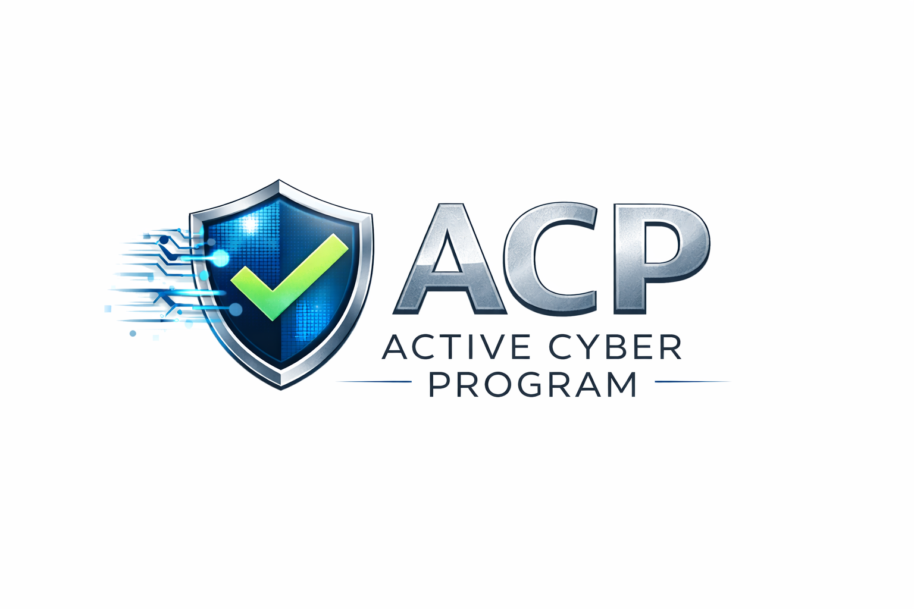

# Active Cyber Program (ACP)



**Active Cyber Program (ACP)** is an open cybersecurity assessment and certification framework designed to evaluate whether an organization operates an **active and effective cybersecurity program**.

ACP focuses on verifying that cybersecurity is **not only implemented but actively managed** across governance, operations, and technical infrastructure.

The framework is designed for organizations of **any size** and is particularly suitable for companies seeking a practical and transparent cybersecurity assurance model.

---

# Purpose

Many organizations deploy security technologies but lack a structured and actively managed cybersecurity program.

The **Active Cyber Program (ACP)** provides a practical framework to evaluate cybersecurity maturity across an organization.

ACP helps organizations:

* demonstrate cybersecurity governance
* strengthen cyber resilience
* improve operational security practices
* provide assurance to customers and partners

---

# ACP Certification

Organizations that meet the requirements of the ACP framework may receive the:

**Active Cyber Program (ACP) Certification**

The certification confirms that the organization operates a structured and actively managed cybersecurity program.

Certified organizations may use the **ACP Trust Label** to demonstrate their cybersecurity commitment.

---

# Certification Authority

The **Active Cyber Program (ACP) Certification** may only be issued by:

**Wechsler Information Solution**

The ACP framework is published to promote transparency and improve cybersecurity practices.
However, the official **ACP Certification** and the **ACP Trust Label** may only be granted following an assessment performed under the authority of Wechsler Information Solution.

Organizations or individuals may use the framework for internal improvement purposes, but they may not issue ACP certifications or represent themselves as an ACP certification authority.

---

# ACP Framework Structure

The ACP framework is structured into three core components:

## 1. Control Domains

The ACP framework defines **ten cybersecurity domains** covering governance, operations and technical security controls.

Examples include:

* Business & Security Governance
* Risk Management
* Identity & Access Management
* Network Security
* Data Protection & Encryption
* Monitoring & Incident Response

Full specification:

`framework/control-domains.md`

---

## 2. Assessment Methodology

Organizations are evaluated using a structured **ACP assessment checklist**.

The checklist verifies whether cybersecurity controls are implemented and actively managed.

Assessment checklist:

`assessment/assessment-checklist.md`

---

## 3. Maturity Model

The ACP framework includes a maturity model to evaluate the **strength and operational effectiveness** of cybersecurity practices.

Maturity Levels:

1. Initial
2. Managed
3. Defined
4. Measured
5. Optimized

Documentation:

`framework/maturity-levels.md`

---

# ACP Trust Label

Organizations that successfully achieve ACP Certification may display the **ACP Trust Label**.

The label indicates that the organization operates an **Active Cyber Program** verified through the ACP assessment process.

See:

`docs/trust-label.md`

---

# Repository Structure

```
active-cyber-program/

README.md

docs/
   certification.md
   trust-label.md

framework/
   control-domains.md
   maturity-levels.md

assessment/
   assessment-checklist.md

templates/
   assessment-report-template.md
   certification-template.md
   improvement-plan-template.md

assets/
   acp-logo.png
   acp-trust-label.png
```

---

# Target Organizations

ACP is designed for:

* small and medium-sized enterprises (SMEs)
* service providers
* technology companies
* public sector organizations
* suppliers in security-sensitive industries

The framework is scalable and adaptable to different organizational environments.

---

# Maintained by

**Wechsler Information Solution**

Germany • Switzerland • Austria

---

# License

This framework is published to promote transparency and improve cybersecurity practices across organizations.

Organizations may use the framework for internal cybersecurity assessments and improvement initiatives.